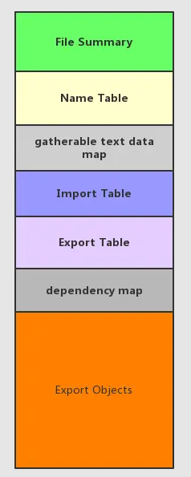

- Setup.bat --cache=C:/UE52/cache
- GenerateProjectFiles.bat
    - 如果有新加源码，需要执行这个 + vs 生成
- vs 生成
    - Developer Editor
    - Win64
    - 启动项 UE5
    - 编译错误
      - SteamVRInputDeviceFunctionLibrary.cpp
        - #pragma warning(disable:4834)
    - 错误列表窗口
      - 生成 + IntelliSense 改成 仅生成
- 调整 vs 布局
  - 工具 - 自定义 - 命令 - 工具栏 - 标准 - 解决方案配置 - 宽度 200


## 独立程序

### IWYU 规则
- 所有头文件包含其所需的依赖性
  - CoreMinimal 头文件包含一套来自UE核心编程环境的普遍存在类型（包括FString、FName、TArray等）。
  - CoreMinimal 头文件（位于UE根目录下：\Engine\Source\Runtime\Core\Public\CoreMinimal.h）将首先被多数的引擎头文件所包含。
- .cpp文件首先包含其匹配的*.h文件
  - A.cpp -> #include "A.h"
- PCH文件已不在是显式包含
- 不在包含单块头文件
  - 如引擎代码包含单块头文件（如 Engine.h 或 UnrealEd.h），编译器将发出警告。

### 验证IWYU已启用
- *.Build.cs
  - 遵循：PCHUsage = ModuleRules.PCHUsageMode.UseExplicitOrSharedPCHs;
  - 不遵循：PCHUsage = ModuleRules.PCHUsageMode.UseSharedPCHs;
  
## 资源

### uasset 文件格式

- File Summary 文件头信息
- Name Table 包中对象的名字表
- Import Table 存放被该包中对象引用的其它包中的对象信息(路径名和类型)
- Export Table 该包中的对象信息(路径名和类型)
- Export Objects 所有Export Table中对象的实际数据。

Asset 是一种既可以被序列化成文件（.uasset, .umap）保存在硬盘，又可以从硬盘加载反序列化到内存中（UObject）的对象，主要用来存储游戏资源（蓝图、贴图、骨骼、声音、特效等）
Edit Preferences, General->Experimental->Core->Text Asset Format Support(√) 选中蓝图，右键->Asset Actions->Export to text format，会生成一份.utxt文件，可以查看基本内容

### AssetRegistry
Asset Registry 是一个编辑器子系统，用于收集项目目录下那些没有被加载到内存中的资产的基本信息（主要工作原理就是扫描指定的目录，然后加载资产的 Summary 信息），它会把这些信息存储在内存中，它还会自动监听资产变动（改名，移动到其他目录，删除等操作）从而保持信息准确。因此 Content Browser 可以根据 Asset Registry 的内容，从而把资产显示出来（并未真的加载，只是利用了它的基本信息）
AssetRegistry 扫描资产生成的缓存会保在本地：C:\lingze\TestProject\Intermediate\AssetRegistryCache；打包后也会生成 AssetRegistry.bin文件。在移动设备运行游戏的时候，AssetRegistry 模块启动就会把 AssetRegistry.bin 加载到内存
```cpp
void FToolbarModule::StartupModule()
{
	//监听资源保存
	UPackage::PackageSavedEvent.AddRaw(this, &FToolbarModule::AssetSaved);
	//监听资源刷新
	IAssetRegistry::Get()->OnAssetUpdated().AddRaw(this, &FToolbarModule::AssetUpdate);
}

UObject* Asset = nullptr;
				
UPackage* Package = LoadPackage(NULL, ObjectInfo.PathName, LOAD_NoRedirects);
if (Package)
{
				Package->FullyLoad();
                
				FString AssetName = FPaths::GetBaseFilename(ObjectInfo.PathName);
				Asset = FindObject<UObject>(Package, *AssetName);
}


FString PackagePath = FString(UTF8_TO_TCHAR(argv[1]));
    UPackage* Package = LoadPackage(nullptr, *PackagePath, LOAD_None);

    if (Package)
    {
        for (TObjectIterator<UClass> It; It; ++It)
        {
            UClass* Class = *It;
            if (Class->GetOuter() == Package)
            {
                UE_LOG(LogTemp, Log, TEXT("UClass found: %s"), *Class->GetName());
            }
        }
    }
    else
    {
        UE_LOG(LogTemp, Error, TEXT("Failed to load package at path: %s"), *PackagePath);
        return 1;
    }
```