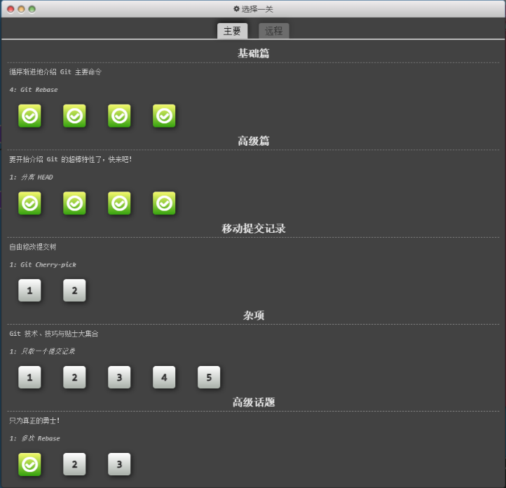

本日工作主要内容

整理入职相关事宜

学习 git 版本控制系统，阅读官方文档 progit.pdf 至51页

了解 git 的特点

文件管理过程的常见状态、各个阶段

学习了 git 基本语法，包括对语法进行本地测试

尝试 git 练习小游戏，目前已通过基础篇 + 高级篇 游戏链接

工作收获（工作，中台，沙龙，AIGC）

了解了 git 与其他版本控制系统的差异以及学习了基础语法

存在问题及改进计划

暂无

 

明天工作计划

继续 git 文档的阅读以及小游戏的实践操作