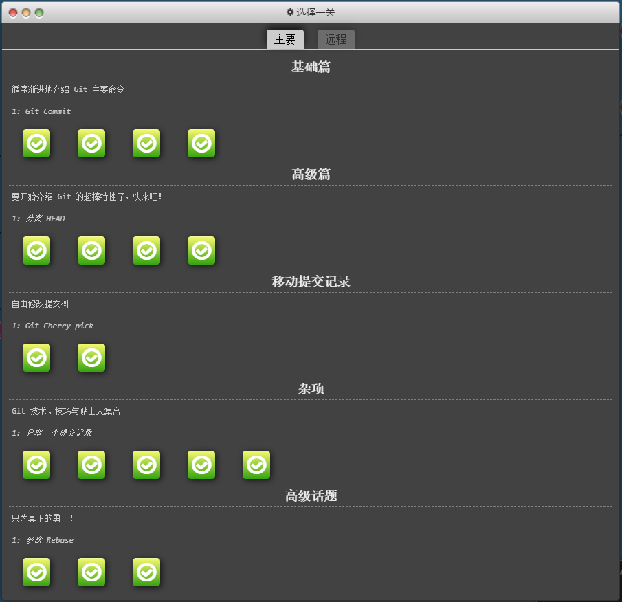
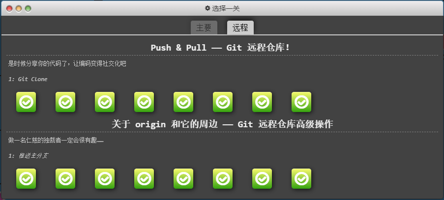

今日工作主要内容

继续 progit.pdf 的阅读

通关 git 学习小游戏

搭建 github 远程仓库并与本地进行交互操作

工作收获（工作，中台，沙龙，AIGC）

通过实践 github 更深刻理解 git 对远程端的交互逻辑

通过小游戏更清晰理解节点之间的关系

存在问题及改进计划

指令比较多，还需要增强日常的使用频率，达到永久记忆

 

明日工作计划

开始学习 python